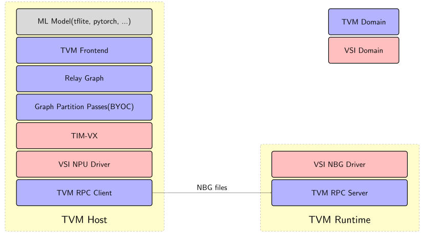

- Feature Name: Use VSI NPU with TVM
- Start Date: 2021-12-10
- RFC PR: TODO
- GitHub Issue: TODO

# Summary

Support Versilicon’s NPU with BYOC framework. Bring the TVM ecosystem to my customers.

# Motivation

Verislicon’s NPU applied on the edge broadly with many SoC vendors. Meanwhile, more and more customers want to build their application with TVM, so we want to bring this capability for them.

# Guide-level explanation

## TVMC User Interface

```python
    export TVM_HOME=<tvm path>
    export PYTHONPATH=$TVM_HOME/python
    export TVM_LIBRARY_PATH=$TVM_HOME/host_compiler_build
    export VIVANTE_SDK_DIR=<VSI NPU driver sdk path>
    export LD_LIBRARY_PATH=<TIM-VX build path>/install/lib:$TVM_LIBRARY_PATH:$VIVANTE_SDK_DIR/drivers:$LD_LIBRARY_PATH
    export VSIMULATOR_CONFIG=<board id>
    export TARGET="vsi_npu, llvm -device=arm_cpu -mtriple=aarch64-linux-gnu"
    export CC=<cross compile toolchain>
    export CC_OPTIONS=<cc option>
    python3 -m tvm.driver.tvmc compile ./mobilenet_v1_0.25_224_quant.tflite --target "$TARGET" -o tvmc.tar \
      --cross-compiler "$CC" --cross-compiler-options "$CC_OPTIONS"
```

# Reference-level explanation

## Design Architecture Overview



**Tensor Interface Module for OpenVX(TIM-VX)** is a library for optimized deep learning inference on VSI NPU device. This integration is based on TIM-VX.

TIM-VX website:
https://github.com/VeriSilicon/TIM-VX

You can find install instructions in:
https://github.com/VeriSilicon/TIM-VX/blob/main/README.md

**NBG(network binary graph)** is the executeble format for the VSI NPU, we can compile it from a host server and deployment it to a target.

## Building TVM with VSI NPU support

Build TVM with TIM-VX(host build):

```bash
    mkdir host_compiler_build
    cd host_compiler_build
    cp ../cmake/config.cmake ./
    # NOTE: 
    # 1.Config llvm by set USE_LLVM to the llvm-config; (For example: llvm-config-10 on Ubuntu 20.04)
    # 2.Add set(USE_VSI_NPU ON) to config.cmake;
    # 3.Disable other backend to speed up build, if you wish.
    cmake -DTIM_VX_INSTALL_DIR=<full_path_to_tim_vx_install> ..
    make tvm -j12
```

Build TVM with TIM-VX(target build):

```bash
    mkdir target_runtime_build
    cd target_runtime_build
    cp ../cmake/config.cmake ./
    # add set(USE_VSI_NPU ON) to config.cmake, you can do it with cmake command option too
    cmake -DTIM_VX_INSTALL_DIR=<full_path_to_tim_vx_target_build_install_dir> \
         -DCMAKE_TOOLCHAIN_FILE=<path_to_cross_compile_toolchain.make> ..
    make runtime -j12
```

## TVM Frontend and Partitioning

Create a Relay graph from a Torchvision Mobilenet_v2 model.

```python
    import tvm
    from tvm import relay
    import torch
    import torchvision

    dummy_input = torch.rand(1, 3, 224, 224)
    model = torchvision.models.quantization.mobilenet_v2(pretrained=True, quantize=True)
    scripted_model = torch.jit.trace(model, dummy_input).eval()
    mod, params = relay.frontend.from_pytorch(scripted_model, [('input', dummy_input.shape)])
```

Annotate and partition the graph for VSI NPU. All ops which are supported by the VSI NPU
integration will be marked and offloaded to VSI NPU. The rest of the ops will go through the
regular TVM compilation and code generation.

```python
    from tvm.relay.op.contrib.vsi_npu import partition_for_vsi_npu
    target_string = "llvm"
    kwargs = {"cc": "aarch64-linux-gnu-gcc", 'fcompile': False}
    disabled_passes = ["AlterOpLayout"]
    with tvm.transform.PassContext(opt_level=3, disabled_pass=disabled_passes):
        mod = vsi_npu.partition_for_vsi_npu(mod, params)
        lib = relay.build(mod, target_string, params=params)
        lib.export_library('NBG.so',  **kwargs)
```

## Test

Load module and run inference on the target machine.

```bash
    # make sure NPU driver installed and can work without error (check dmesg after you insmod galcore)
    # 0.Append tvm/python 
    export PYTHONPATH=<path/to/tvm/ptyon>:$PYTHONPATH
    # 1.Setup libraries
    export LD_LIBRARY_PATH=<path/to/versilicon/driver/sdk>:<path/to/tim-vx/target/install>:<path/to/tvm/target_runtime_build/>:$LD_LIBRARY_PATH
    # 2. start service on given TCP port
    python3 -m tvm.exec.rpc_server --host 0.0.0.0 --port=9090
```

With precompiled model into NBG format, it’s easy to deploy in the production environment. If we need to add new operation support, we just need to update the Code-Gen part, there is no update required for the runtime libraries.

Execute test from host.

```bash
    # 0. Set correct NPU target name for your device, you can learned this from your soc vendor
    export VSIMULATOR_CONFIG=PID_0x99
    # 1. Set up testcase, please refer model list from tests/python/contrib/test_vsi_npu/test_vsi_tflite_model_all.py
    export TFLITE_MODEL="<full/path/to/mobilenet_v1_1.0_224_quant.tflite>"
    # 2. Setup cross compile toolchain configuration 
    export PATH=<cross-compiler-path>:$PATH
    export CROSS_CC=<cross-compiler-binary-name>
    export ROOTFS=<rootfs-for-cross-compile>
    # 3. Remote service configuration
    export RPC_HOST=<target device ip address>
    export RPC_PORT=<TCP port exposed by the service>
    # debug purpose
    export MOD_PATH="<any/folder/can/write>"
    export MOD_NAME="NBG.so" # could be any name, for debug purpose
    # 4. Add TVM to LD_LIBRARY_PATH
    export LD_LIBRARY_PATH=<path/to/host_compiler_build/>
    # 5. Execute test
    python3 tests/python/contrib/test_vsi_npu/test_vsi_tflite_model_all.py
```

# Drawbacks

- TIM-VX provide hand coded kernels. Therefore, code generation skips the auto tuning capabilities of TVM. In future, we wish to make use of full power of TVM's auto scheduling.

- One NBG file only support one graph now. So if BYOC partition multi graphs to VSI NPU, it will failed. We plan to support multi graphs soon.

# Future possibilities

- About 150+ operators is supported in TIM-VX. We plan to support it in VSI NPU backend in the next year.
